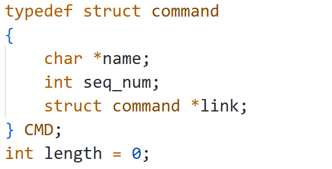
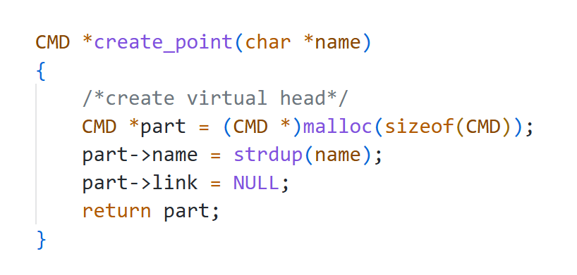
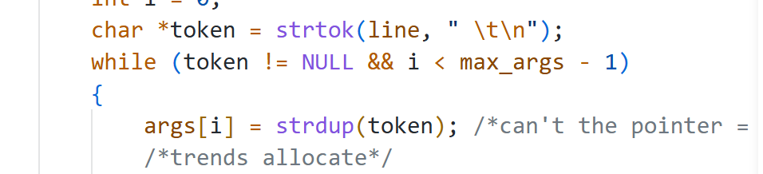
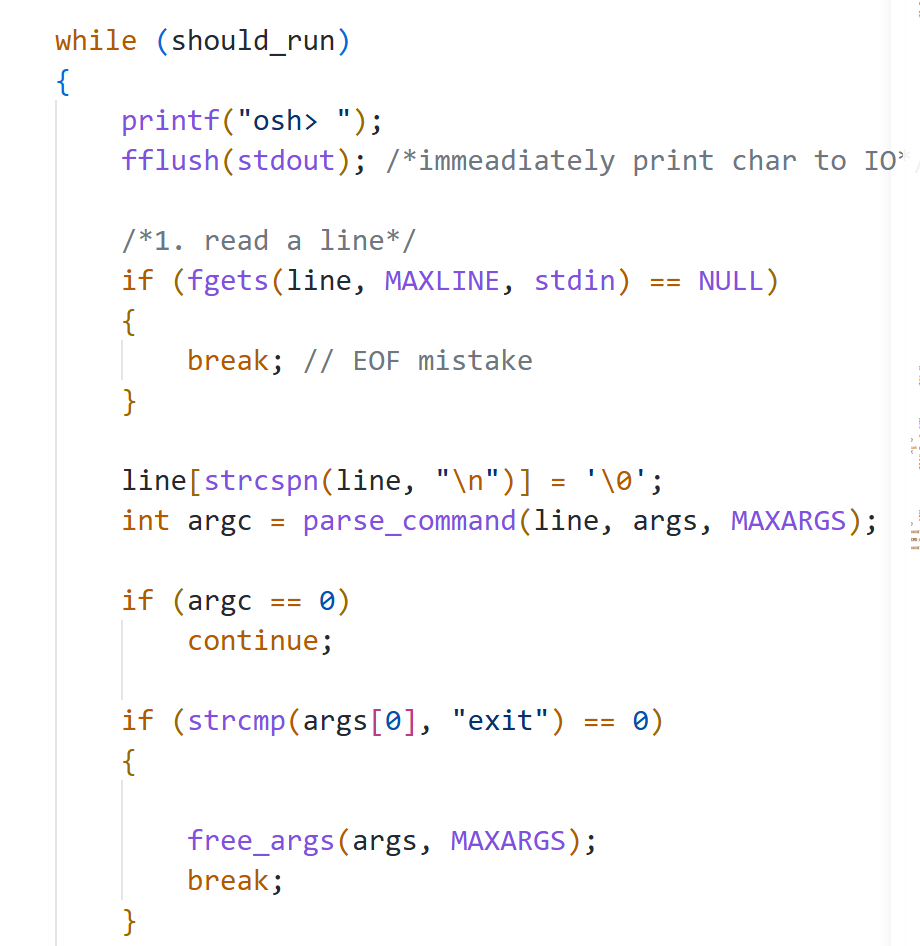
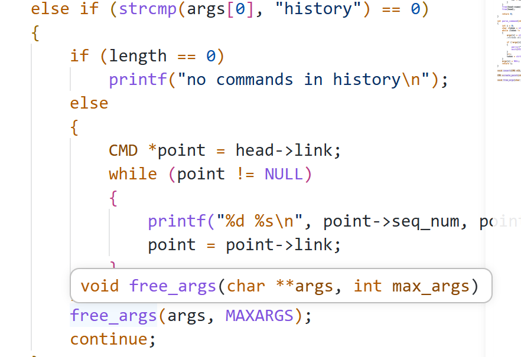
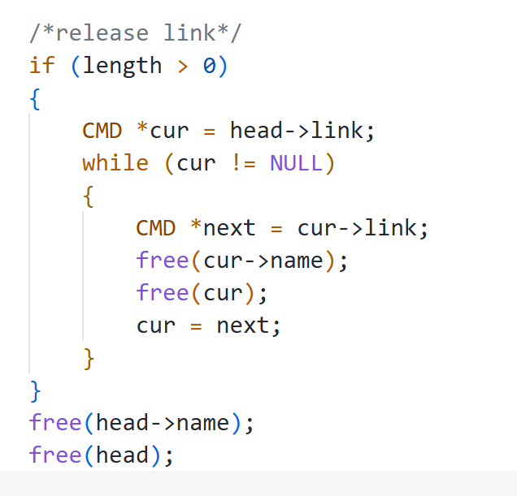

总结在project1项目中产生的内存管理问题

### 1.指针不初始化，使用野指针赋值
指针初始化:使用malloc/new/strdup(此函数等价于malloc+strcmp)/NULL等分配内存的函数或空指针
明确指针地址，未初始化的指针地址是随机值

name和结构体command就没有分配内存是野指针

对指针执行了初始化

### 2.copy问题导致内存泄露
内存泄漏:申请分配内存后,没有释放内存最后发生内存不足

token是一个指向使用strtok分割后的字符串子串指针,args是char *[]类型的指针数组,没使用strdup之前，使用for循环对每个args[i]使用malloc分类大小80的内存,在这个情况下使用args[i]=token;发生args[i]的指针和token的指针相同了，导致之前malloc分配的内存无指针指向,也无法释放了;strdup函数的意思是
分配与该函数参数相同大小的内存,并赋值该参数的解引用;实现相同的值但位于不同的内存地址.

### 3.循环问题导致内存泄露

while的每一次循环都会访问已经分配内存的args指针数组,不释放的话continue后，下一次while循环会导致旧内存的args指针指向新的strdup分配的内存,上一个循环分配的内存发生内存泄露

### 4.程序退出没有释放内存发生内存泄露

在程序结束退出时,没有释放链表分配的内存就会发生内存泄漏

### 5.释放野指针
对没有初始化的指针使用free()释放
